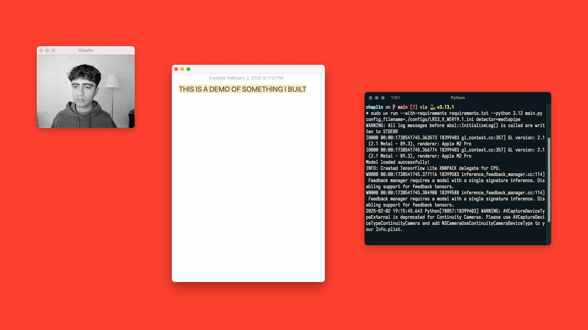

# Chaplin



A visual speech recognition (VSR) tool that reads your lips in real-time and types whatever you silently mouth. Runs fully locally.

Relies on a [model](https://github.com/mpc001/Visual_Speech_Recognition_for_Multiple_Languages?tab=readme-ov-file#autoavsr-models) trained on the [Lip Reading Sentences 3](https://mmai.io/datasets/lip_reading/) dataset as part of the [Auto-AVSR](https://github.com/mpc001/auto_avsr) project.

Watch a demo of Chaplin [here](https://youtu.be/qlHi0As2alQ).

## Setup

1. Clone the repository, and `cd` into it:
   ```sh
   git clone https://github.com/amanvirparhar/chaplin
   cd chaplin
   ```
2. Run the setup script...
   ```sh
   ./setup.sh
   ```
   ...which will automatically download the required model files from Hugging Face Hub and place them in the appropriate directories:
   ```
   chaplin/
   ├── benchmarks/
       ├── LRS3/
           ├── language_models/
               ├── lm_en_subword/
           ├── models/
               ├── LRS3_V_WER19.1/
   ├── ...
   ```
3. Install and run `ollama`, and pull the [`qwen3:4b`](https://ollama.com/library/qwen3:4b) model.
4. Install [`uv`](https://github.com/astral-sh/uv).

## Usage

1. Run the following command:
   ```sh
   uv run --with-requirements requirements.txt --python 3.12 main.py config_filename=./configs/LRS3_V_WER19.1.ini detector=mediapipe
   ```
2. Once the camera feed is displayed, you can start "recording" by pressing the `option` key (Mac) or the `alt` key (Windows/Linux), and start mouthing words.
3. To stop recording, press the `option` key (Mac) or the `alt` key (Windows/Linux) again. The raw VSR output will get logged in your terminal, and the LLM-corrected version will be typed at your cursor.
4. To exit gracefully, focus on the window displaying the camera feed and press `q`.
